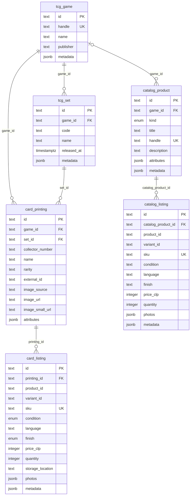

# Banned Cards custom catalogue ERD

This diagram contains only the tables defined by the Banned Cards `tcg-catalog` module. Medusa core tables are intentionally omitted.

The arrows describe the intended catalogue relationships. At present, the module stores relationship IDs as indexed `text` columns; PostgreSQL foreign-key constraints are not defined for them. The `product_id` and `variant_id` fields on both listing tables point to Medusa core records, which are outside this custom-only diagram.

All six tables also receive Medusa's standard `created_at`, `updated_at`, and nullable `deleted_at` columns.

## Reading the model

- A game has sets, card printings, and optional generic catalogue products.
- A set contains card printings. The 856 imported LTR records are in `card_printing`.
- A card printing can have multiple sellable listings for different conditions, languages, or finishes.
- A generic catalogue product represents a single, sealed product, or accessory and can have multiple catalogue listings.
- Listings carry the local CLP price and quantity while their optional Medusa IDs connect them to checkout and inventory.
